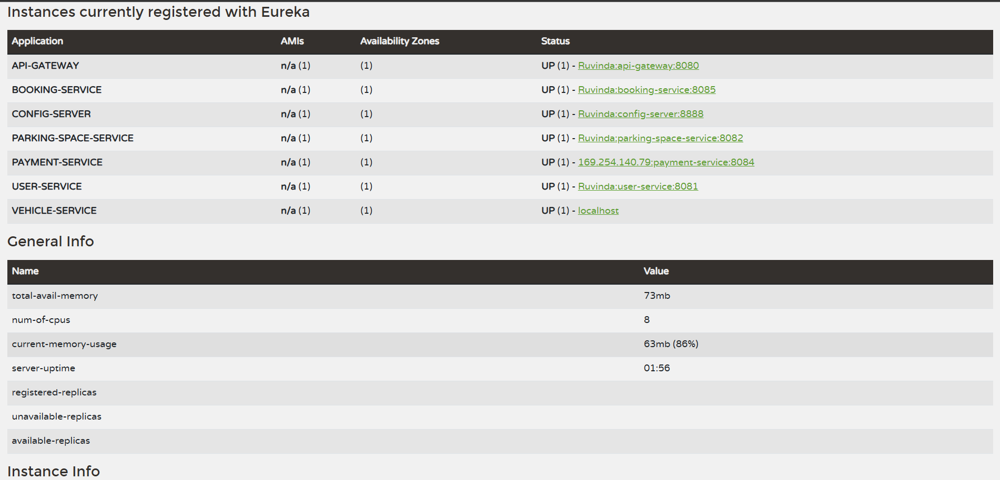

# Smart Parking Management System (SPMS) — Cloud-Native Polyglot Backend

> **Author:** Ruvinda Shaluka  
> **Program:** Graduate Diploma in Software Engineering (GDSE) — AAD2 Coursework  
> **Architecture:** Cloud-Native Polyglot Microservices  
> **Postman Collection Reference:** [Postman Collection](./postman_collection.json)

---

## 🌟 Architectural Highlight: Booking Microservice Addition

> [!IMPORTANT]
> ### 🚀 Enhanced Feature Addition: Booking & Reservation Service (`port: 8085`)
> To fully accomplish the core business objective of **real-time parking reservations and historical booking logs for users and administrators**, the architecture has been enhanced with a dedicated **Booking Service (Java 21 / Spring Boot / Spring Data JPA)**.
> 
> Although not initially planned in the baseline prototype, this microservice fulfills the distributed domain boundary between parking space inventory management, vehicle tracking, and automated payment receipts.

---

## 🏛️ System Architecture

The Smart Parking Management System (SPMS) is engineered using a **polyglot microservices paradigm**, orchestrating Java Spring Boot, TypeScript Node.js, and Python Flask services behind a single Spring Cloud Gateway and Netflix Eureka Service Registry.

```text
                               +------------------------------------------+
                               |        Client (Next.js 15 Frontend)      |
                               +------------------------------------------+
                                                    |
                                                    v
                               +------------------------------------------+
                               |     API Gateway (Spring Cloud Gateway)   |
                               |               Port: 8080                 |
                               +------------------------------------------+
                                                    |
               +-------------------+----------------+-------------------+-------------------+
               |                   |                |                   |                   |
               v                   v                v                   v                   v
      +-----------------+ +-----------------+ +-------------+ +-----------------+ +-----------------+
      |  User Service   | | Parking Space   | |   Vehicle   | | Payment Service | | Booking Service |
      |   (Java 21)     | |    Service      | |   Service   | | (Python 3/Flask)| |   (Java 21)     |
      |   Port: 8081    | |   (Java 21)     | | (Node.js/TS)| |   Port: 8084    | |   Port: 8085    |
      |   spms_user_db  | |   Port: 8082    | | Port: 8083  | | spms_payment_db | | spms_booking_db |
      |                 | | spms_parking_db | |spms_veh_db  | |                 | |                 |
      +-----------------+ +-----------------+ +-------------+ +-----------------+ +-----------------+
               |                   |                |                   |                   |
               +-------------------+----------------+-------------------+-------------------+
                                                    |
                                                    v
                               +------------------------------------------+
                               |        Eureka Discovery Server           |
                               |               Port: 8761                 |
                               +------------------------------------------+
                                                    ^
                                                    |
                               +------------------------------------------+
                               |         Centralized Config Server        |
                               |               Port: 8888                 |
                               +------------------------------------------+
```

---

## 🖥️ Service Discovery & Registry (Eureka Dashboard)

All 7 services (API Gateway, Config Server, User Service, Parking Space Service, Vehicle Service, Payment Service, and Booking Service) dynamically register with Netflix Eureka Service Registry on port `8761`.



*Figure: Spring Cloud Netflix Eureka dashboard showing all polyglot microservices with status `UP`.*

---

## 🛠️ Technology Stack Breakdown

| Service | Technology | Database | Key Libraries |
|---|---|---|---|
| **Discovery Server** | Java 21, Spring Cloud Netflix Eureka | — | Eureka Server |
| **Config Server** | Java 21, Spring Cloud Config Server | Native Files | Centralized repo |
| **API Gateway** | Java 21, Spring Cloud Gateway | — | Dynamic Route Locator, Global CORS |
| **User Service** | Java 21, Spring Boot 4.x | MySQL (`spms_user_db`) | Spring Data JPA, Spring Security, BCrypt, JJWT, Lombok |
| **Parking Space Service**| Java 21, Spring Boot 4.x | MySQL (`spms_parking_db`) | Spring Data JPA, Hibernate, Jakarta Validation, Lombok |
| **Vehicle Service** | Node.js, Express, TypeScript | MySQL (`spms_vehicle_db`) | Sequelize ORM, Zod, UUID, CORS, Eureka-js-client |
| **Payment Service** | Python 3.10+, Flask | MySQL (`spms_payment_db`) | Flask-SQLAlchemy, PyMySQL, Py-Eureka-Client, Python-Dotenv |
| **Booking Service** | Java 21, Spring Boot 4.x | MySQL (`spms_booking_db`) | Spring Data JPA, Jakarta Validation, Eureka Client |

---

## 🔒 Security & Optimization Highlights

1. **Password Security:** Users passwords are encrypted with industry-standard `BCryptPasswordEncoder` (strength 10). Plain-text passwords are never stored or logged.
2. **Stateless Authentication (JWT):** Generates signed HMAC-SHA256 tokens containing user roles and claims with 24-hour expiration.
3. **DTO Abstraction Layer:** All external communication is strictly mapped via Data Transfer Objects (DTOs) to prevent sensitive attribute leakage.
4. **Input Validation:** Enforced at every layer via Jakarta Bean Validation (`@Valid`, `@NotBlank`, `@Email`, `@Min`), Zod schemas (TypeScript), and Flask sanitization.
5. **No Hardcoded Secrets:** All database passwords and keys are externalized through environment variables and configured in `.env.example`.
6. **Global CORS & Gateway Routing:** Handled through Spring Cloud Gateway configuration allowing frontend clients without header friction.

---

## 📋 API Endpoints Reference

All endpoints are accessible via the single gateway URL: `http://localhost:8080`.

### 1. User Service (`/users/**`)
- `POST /users/register` — Register a driver or space owner.
- `POST /users/authenticate` — Authenticate and receive a signed JWT token.
- `GET /users` — List all registered users (Admin).
- `GET /users/{id}` — Get profile details.
- `PUT /users/{id}` — Update user profile.
- `DELETE /users/{id}` — Delete user by ID.

### 2. Parking Space Service (`/spaces/**`)
- `GET /spaces` — Retrieve all registered parking slots.
- `GET /spaces/available` — Retrieve only currently available parking spaces.
- `GET /spaces/{id}` — Get details for a specific slot.
- `GET /spaces/city/{city}` — Filter parking spaces by city name.
- `GET /spaces/zone/{zone}` — Filter parking spaces by urban zone.
- `GET /spaces/owner/{ownerId}` — List spaces belonging to a specific provider.
- `GET /spaces/filter?city=Colombo&zone=Zone A` — Multi-criteria query.
- `POST /spaces` — Register a new parking space.
- `PUT /spaces/{id}` — Update parking slot information and pricing.
- `PUT /spaces/{id}/status` — Update space availability status.
- `DELETE /spaces/{id}` — Remove parking slot from system.

### 3. Vehicle Service (`/vehicles/**`)
- `POST /vehicles` — Register a vehicle with license plate, make, and model.
- `GET /vehicles` — Retrieve all registered vehicles.
- `GET /vehicles/{id}` — Retrieve vehicle by primary ID.
- `GET /vehicles/owner/{ownerId}` — Retrieve all vehicles owned by a specific user.
- `PUT /vehicles/{id}` — Update vehicle attributes.
- `PUT /vehicles/{id}/status` — Simulate IoT entry (`status: "IN"`) or exit (`status: "OUT"`), updating timestamps.
- `DELETE /vehicles/{id}` — Remove vehicle record.

### 4. Payment Service (`/payments/**`)
- `POST /payments` — Process payment transaction and generate unique receipt number.
- `GET /payments` — Retrieve list of all processed payments.
- `GET /payments/{id}` — Retrieve payment details by ID.
- `GET /payments/{id}/receipt` — Generate digital formatted receipt object.
- `GET /payments/user/{userId}` — Retrieve payment history for a user.
- `GET /payments/booking/{bookingId}` — Retrieve payment transaction for a booking.
- `PUT /payments/{id}/refund` — Issue a refund on a payment.

### 5. Booking Service (`/bookings/**`)
- `POST /bookings` — Create a new parking reservation.
- `GET /bookings` — List all bookings in the system.
- `GET /bookings/{id}` — Retrieve booking details by ID.
- `GET /bookings/user/{userId}` — Retrieve user reservation history.
- `GET /bookings/space/{spaceId}` — Retrieve all bookings for a parking space.
- `PUT /bookings/{id}/status` — Update booking status.
- `PUT /bookings/{id}/cancel` — Cancel a reservation.
- `PUT /bookings/{id}/complete` — Mark reservation complete.
- `DELETE /bookings/{id}` — Remove booking record.

---

## 📮 Postman Collection

A complete, production-ready Postman collection with environment variables and pre-configured request payloads is included:

👉 **[Postman Collection](./postman_collection.json)**

To import into Postman:
1. Open Postman.
2. Click **Import**.
3. Select `postman_collection.json`.
4. Run requests against `http://localhost:8080`.

---

## 🚀 Setup & Execution Guide

### 1. Prerequisites
- **Java Development Kit (JDK):** 21
- **Node.js:** v18+
- **Python:** 3.9+
- **MySQL Server:** Running on `localhost:3306`

### 2. Environment Configuration
Copy `.env.example` to your microservice folders or configure environment variables:
```bash
cp .env.example .env
```

### 3. Recommended Boot Sequence
1. **Discovery Server (Eureka)**
   ```bash
   cd discovery-server && ./mvnw spring-boot:run
   # Wait for http://localhost:8761
   ```
2. **Config Server**
   ```bash
   cd config-server && ./mvnw spring-boot:run
   # Wait for http://localhost:8888
   ```
3. **API Gateway**
   ```bash
   cd api-gateway && ./mvnw spring-boot:run
   # Wait for http://localhost:8080
   ```
4. **Microservices (Any order)**
   - **User Service:** `cd user-service && ./mvnw spring-boot:run` (Port 8081)
   - **Parking Space Service:** `cd parking-space-service && ./mvnw spring-boot:run` (Port 8082)
   - **Vehicle Service:** `cd vehicle-service && npm run dev` (Port 8083)
   - **Payment Service:** `cd payment-service && python run.py` (Port 8084)
   - **Booking Service:** `cd booking-service && ./mvnw spring-boot:run` (Port 8085)
